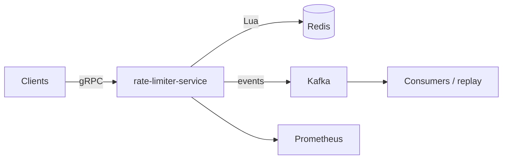

# TrafficGate

[](LICENSE)
[](rate-limiter-service/)
[](docs/architecture.md)
[](docs/architecture.md)

**TrafficGate** is a distributed rate limiting service. It enforces per-client quotas across multiple nodes using atomic Redis Lua scripts, streams decisions to Kafka for replay and anomaly detection, and exposes a gRPC API for low-latency checks.

**Author:** [fujai2004](https://github.com/fujai2004)

---

## Features

- **Token-bucket rate limiter** in Java with **atomic Redis Lua scripts**, so there are no cross-node race conditions
- **Kafka event stream** of rate limit decisions, with partition-keyed consumers for replay and burst anomaly detection
- **gRPC API** for synchronous allow/deny checks
- **Prometheus metrics** and Docker-based deployment
- **k6 load tests** for burst and sustained traffic

---

## Performance

<!-- TODO: replace with measured results from load-tests/ -->
Load-tested with k6 under burst and sustained traffic.

| Scenario | Throughput | p50 | p99 |
|----------|-----------|-----|-----|
| Sustained | _TBD_ | _TBD_ | _TBD_ |
| Burst | _TBD_ | _TBD_ | _TBD_ |

---

## Architecture



| Component | Stack | Role |
|-----------|-------|------|
| `rate-limiter-service/` | Java, gRPC | Token bucket, quota enforcement |
| Redis | Lua scripts | Atomic counters per client |
| Kafka | Partitioned topics | Decision log, replay, analytics |
| `load-tests/` | k6 | Burst and sustained load validation |
| `deploy/` | Docker Compose | Local and containerized runs |

See [docs/architecture.md](docs/architecture.md) for design details.

---

## Repository layout

```
TrafficGate/
├── rate-limiter-service/   # Java gRPC service
├── load-tests/             # k6 scripts
├── deploy/                 # Docker Compose
├── docs/                   # Design notes
└── .github/workflows/      # CI
```

---

## Quick start

```bash
git clone https://github.com/fujai2004/TrafficGate.git
cd TrafficGate
docker compose -f deploy/docker-compose.yml up -d
# gRPC endpoint: localhost:50051
```

### Run the load tests

```bash
k6 run load-tests/<script>.js
```

---

## Development

1. See [docs/architecture.md](docs/architecture.md) for the design.
2. See [docs/roadmap.md](docs/roadmap.md) for future work.
3. Issues and pull requests are welcome.

---

## Tech stack

| Area | Technologies |
|------|----------------|
| Service | Java 17+, gRPC |
| State | Redis (Lua) |
| Events | Kafka |
| Observability | Prometheus |
| Testing | k6 |
| Packaging | Docker |

---

## License

MIT. See [LICENSE](LICENSE).
